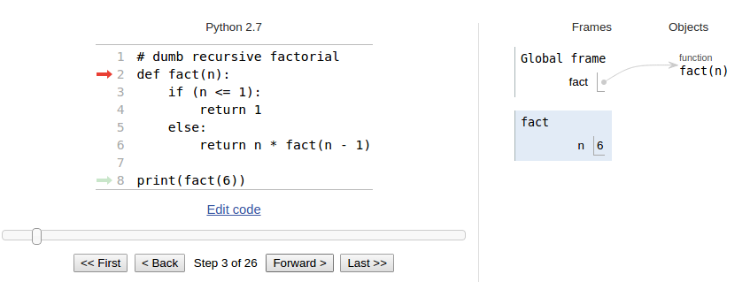
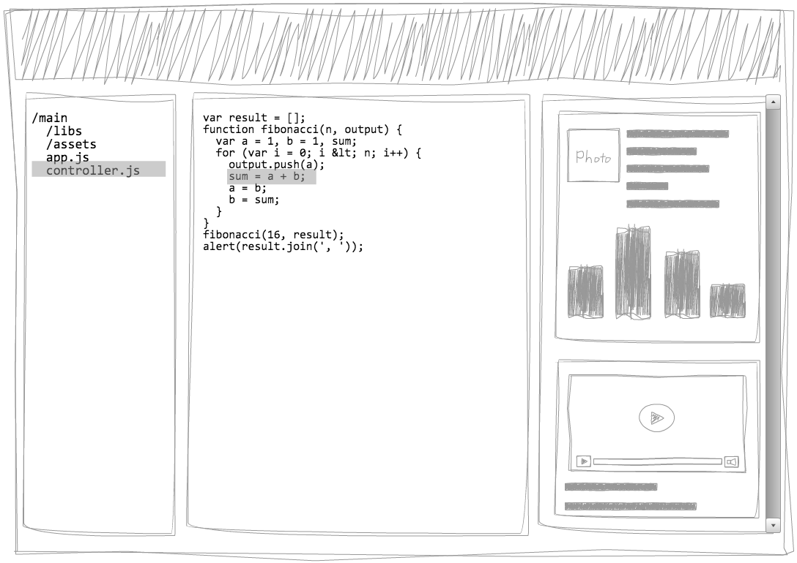
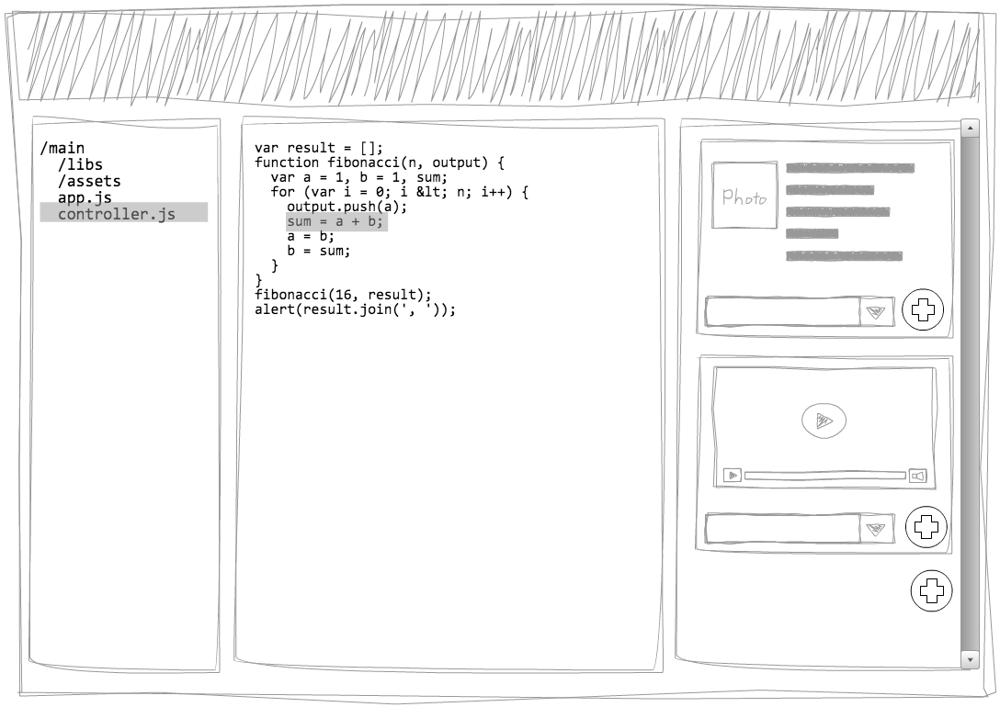

# Research Report - WebOS Narrative

### Roelof Sol
### Maarten van Beek
### Salim Salmi

# Product definition

Consider the following user story:

Bob is a professor at the university in Delft specializing in algorithmics. Next to his work in this field he also teaches students the fundamentals, theory and science behind algorithms. For this reason he often needs to write simple programs to demonstrate these algorithms in class. However he found that often there is confusion when explaining code to his students as the code and the execution are disjoint. For this reason he wants to be able to go through his code in a step by step manner and display the effects of each step.

Ever been completely lost in the code of someone else? Or you wished that someone would have provided you with more information about the functioning, pitfalls and purpose of the code? In many cases you will have to go over each line, think about example executions and consider various cases. This process is time consuming and in the end, it is either unsuccessful or finishes often with "Oh, of course! ..... Well I wish somebody had told me sooner". This scenario can limit the evolution of projects.

This application serves as a way to help developers illustrate their projects in a more comprehensive and detailed manner. 

For convenience and clarity we will call the developer who wants to illustrate his project and or code the Writer and the user who would want to see the explanation we will call the Viewer

With the aid of this application, a developer who we will call the Writer can create a narrative for his or her project.
Borrowed from the actual definition of the word: in short a narrative is a sequence of connected events, presented in a sequence of written words, and/or in a sequence of (moving) pictures. The writer can create these narratives by adding elements called narrative primitives to a part of a project. An example of a narrative primitive could be a textual explanation, an illustrative image or a video presentation. On top of this, parts of the code itself can be narrated in this manner. The Writer can select a step in the code and provide it with some explanation in the form of these narrative primitives. Much like a debugger, the Viewer can then go through the code in a step by step manner. However this time the Writer can not only use text or images but can also access the variables in the code to provide the Viewer with an animation based on the state of the variables during execution. To access animations the Writer manipulates visual objects that are either given or self written. When these objects reach their updated state they will display the new state of the animation. An example would be a bar chart. The Writer can specify a bar chart should be used to visualize a certain part of the code, and than make calls to the bar chart object at the desired places in the code.

The Writer can make multiple narratives for his project and can decide for himself or herself on what level of abstraction. Lastly a Writer can link from within a narrative to another narrative which allows for reusability.

To conclude, the aim is to allow the Writer to convey meaning through dynamic story telling by easily being able to couple story telling elements with his code.

# Glossary

Here are some definitions used throughout the document:
* **AST**: Abstract syntax tree. A tree that represents the structure of source code written in a programming language. Nodes in this tree can be constants or variables (leaves) and operators or statements (inner nodes).
* **File/Folder tree**. Basic file and folder structure.
* **CAST**: Context abstract syntax tree. Combination of File/Folder tree & AST. A node in the CAST can be a file, a folder or a node that is available in the AST.
* **Narrative**: A Sequence of Narative Primitives attached to a node in the CAST.
* **Code Narrative**: A Narrative that is located in an AST node. 
  * Has access to the scope of the AST node.
  * Can specify locations in the AST that, when reached, display a Narrative Primitive.
* **Narrative Primitives**: A step/element in a Narrative that a user can step through. 
  * Text
  * Video 
  * Image
  * Link to a narrative
  * Visualization call
* **Visualization**: Object with functions to animate/update a graphic. examples: Graph, table, pie-chart.
* **Narrative graph**: A graph representing related narratives. 
* **Viewer**: A person that views/follows Narratives or selects a CAST Node to gain more insight about that node.
* **Writer**: A person that writes Narratives for nodes attached to the CAST.

# User stories

Some additional user stories:

Bob is a Computer science teacher and wants to teach his students about BubbleSort
He had a thought on how this could be made more intuitivly for his students if they can see the code in action 
by swapping bars in a bar graph. 
He loads his bubblesort code into the program. 
He adds code to display the original array 
He adds code at the swap elements to swap the location of the visual elements in the canvas
He shows his students the execution. 

Alice has written a js interpreter. She wants people to quickly see how it works. 
She codes up a visual display for a stack, a venndiagram to represent the variables and their scope.
At every type of step , the variable used are highlighted and moved to represent the step. 

Charlie wants to show his students how to do matrix multiplication. 
He takes a simple double nested loop code and loads this into our program.
He codes the matricis to be displayed one left , the other on top and an empty matrix in the middle. 
At the multiplication step two arrows from the original matricies point to the empty spot. 

* An algorithms teacher wants to visualize some algorithms for his students so that it is easier to explain
* A student wants step through a visualization of an algorithm so that he understands it better
* A developer wants to show his fellow developers quickly how his code solves a problem in the interrest of saving time
* A developer wants to display a certain data structure so that he can show this to his coworkers. 
* A developer wants to gain insight in a specific part an algorithm 
* A developer wants to add some visualizations to someone elses code to understand it better

# Existing solutions
We've researched some of the existing solutions for interactive code documentation, interactive storytelling and algorithm visualization. This chapter lists some notable examples. 

## [code-guide](http://www.natpryce.com/software/code-guide/example/selector-button-blink.html)

Code guide is a solution to generate interactive documentation from python files. It works by writing a string of documentation and linking it to one or more lines of code. When the interactive documentation is started, the lines of code for which documentation is available are highlighted in sequence and it's documentation is shown in a text bubble. Highlighting the relevant code is a useful visual element. 

## [Python  Tutor](http://www.pythontutor.com/)
Python tutor is a tool that explains the execution of a python script. It does ths by stepping through the code like a debugger and showing the state of the program on the right. It shows fairly low level animations with no possibility to be extended. This tool allows for exploring the code by stepping through it's execution, however it doesn't allow the writer to add a personalized output. 

## Existing documentation frameworks
There are many tools for adding for generating documentation for code. A few examples are [Doxygen](http://www.stack.nl/~dimitri/doxygen/), [JSDoc](http://www.lsauer.com/2013/05/javascript-documentation-generator.html) and [Sphinx](http://sphinx-doc.org/). 
These documentation tools commonly scan the code to generate a documentation. However, after the documents are generated there's no further interaction with the project. 

## Static code visualizations
Handmade algorithm visualisations can function as inspirations for the possible animations that our application can generate. A website that contains many interesting visualizations is http://bost.ocks.org/mike/algorithms/. 

## Interactive storytelling 
Interactive storytelling is a way of article writing in which the article develops as the reader is reading it. Interaction with the document can influence the outcome of the document. This is a method that we can use for our visualization, interaction with the document will the determine what elements the reader needs explanation on. 
An example is the following new york times article: http://www.nytimes.com/interactive/2014/09/19/travel/reif-larsen-norway.html. New views open as the reader scrolls though the document and explanatory visualizations show up as you scroll over them. 

# Technologies and Limitations

The project is based in the browser. Therefore the browser API is very important to the project. Apart from that we have defined 3 parts for which we will use existing solutions. These are:
* Code Editor
* JS Interpreter
* Visualization libraries

This section contains our assessment of the options and some limitations created by these technologies or time constraints. The conclusion states our selection. 

## Technologies and Libraries

### Code editor

In the application the goal is to enhance the readability and the understandability of some code. This code has to be able to be viewed by the user so that he can make these enhancements with use of visualizations. The code for the visualizations must also be able to be viewed, but also written and edited. For this purpose we need to have a way to display code in a comprehensible way to be viewed and in some cases edited by the user. Since there already are conventions for how code is formatted we can look for some existing solutions to use in our application.

##### Requirements:
* Easy to use
* Easy to edit
* Lightweight (not a lot of code)
* Simple (not to full featured)
* Open source

##### List of Options:
* [Ace](http://ace.c9.io/)
* [Code Mirror](http://codemirror.net)
* [ICE Coder](https://icecoder.net/)
* [Codiad](http://codiad.com/)

These options are the commonly used code editors for the web. Ace and Code mirror are popular in use with services like web based development platforms like c9.io and jsfiddle.net. Ace and Code mirror are the most simple with only having the minimal most common features you would expect in a code editor like syntax highlighting, automatic indent and outdent and code folding. On top of that they allow to be embedded into html document, which gives more freedom for how the document is structured. 

##### Pros:
* Very lightweight
* Easy to embed
* Lot of freedom

##### Cons: 
* Have to implement features we need that are missing

The two later options, ICE Coder and Codiad are not meant for embedding but rather are to be adjusted to fit our needs. They are full web based IDEs and among other things feature support for a multitude of languages, can be used online or locally, has its own file manager on top of all the common features the previous two code editors have.

##### Pros:
* Already feature heavy
* No need to embed
* Can be accessed online and offline

##### Cons:
* Requires more setup
* Takes more time to learn how it works
* Requires to implement the graphical tool into the IDE

The question now is, which of these two approaches is optimal for use in our solution. On the one hand we have the smaller code editors Ace and Code mirror who we can use to embed into an environment we make. And on the other hand we have the larger ICE coder and Codiad which we would add our features onto. 

For the purpose of our application the smarter option would be to use either Ace or Code mirror because it requires minimal setup and minimal time to learn. The features it gives should be adequate for what we need it to do. This also allows us to have more freedom when designing the rest of the system as we do not have to implement it into the Code Editor but allows us to have a more modular design.

Both of these editors are widely supported and the most actively used in their field. Ace is used and supported by c9.io and also supported by Mozilla, code mirror is used by jsfiddle.net and codepen.io, so both editors do not lack in support. Code mirror is smaller in size and is historically more stable and has better browser compatibility. Ace however has a couple more useful features and is overall more polished. Lastly the documentation of Ace is comprehensible and overall easier to use than the documentation of Code mirror. 

In the end we experimented with both editors. We concluded that Ace would be the best option out of the two because it better documented and has more beneficial features.

### Interpreter 

To add meta code to specific statements in a piece of javascript code we need to break it down in it's logical components. Than we need to step through these components, and as we execute them we also execute the meta code that is linked to it. This behavior is very similar to an interpreter, with the addition that some extra code can be linked to a statement which is executed when the statement is executed. 

Requirements:
* Written in javascript, so we can use it in the browser
* Easy access to the scope, so it can be used in the meta code
* Simple, so that we can easily extend it to fit our needs

#### [JS-Interpreter](https://neil.fraser.name/software/JS-Interpreter/)
A simple javascript interpreter which allows stepping through the code. It uses [acorn](https://github.com/marijnh/acorn) for parsing. 

##### Pro's
* Written in javascript
* Support stepping
* Small (about 2000 lines of code)

##### Con's
* Supports a limited form of javascript (no try/catch for example)

### Visualization Libraries
At a CodeNarative of the Reader, the CodeNarative code gets passed the scope at the moment the interpreter passes the AST Node and a VScope object containing the visualizations that are active within the narative. 

It is important for the visualization framework to give the Writer an intuitaive and quick way to initiate or update some state of some visualization. 

For the purpose of visualizing a some transition it would be nice to have the ability to animate the visualizations.
When running a visualization we would like the ability to jump to the end when a user decides they want to jump to the next step. 
The list of options that have been considered

#### Canvas Based
* Basic Canvas 
* [Pixijs](http://www.pixijs.com/)
* [fabricjs](http://fabricjs.com/)
* [infovis](http://philogb.github.io/jit/)

**HTML5 Canvas**
The standard HTML5 canvas is very low level. It will only allow the Writer to draw on top of what is already there and it does not have standard utilities for manipulating some object relative to another object. 
Pros:
* Fast
* Excelent support 
* Well known

Cons:
* not trivial to bind an object to a visualization object
* not trivial to place objects relative to one another
* Any new functions must also be documented

**Pixijs**
A Canvas type framework that enables easy loading and has some built in features for attaching visualizations and the animation loop
Pros:
* Anchor points
* Image loading

Cons:
* No self contained visualization object. 

**Fabricjs**
The main features of Fabricjs seem to be aimed toward interacting with the canvas. This is not a feature that is particularly useful to our project

**InfoVis**
A high level data visualization framework. It has many standard visualization objects. 

Pros:
* Standard visualization objects
* Decent documentation & demo's

##### Vector Graphic Based
* Basic SVG
* [raphael](http://raphaeljs.com/)
* [D3](http://d3js.org/t)

**HTML5 SVG DOM elements**
The default SVG elements are another possibility. 
It is XML based and lives inside the DOM. 

Pros:
* CSS / DOM API

Cons:
* No prefab visualizations

**D3**

Pros:
* Visualization based on updating data.
* Build in support for tree/graph layout
* Large community 

Cons:
* Bloated with data import functions.

###### infovis

Pros: 
* Visualization based on updating data.
* Build in support for tree/graph layout

An open question at this moment is: is it useful to allow the Writer to choose from multiple options?

## Conclusion 
For the editor we will settle on Ace. The Interpreter leaves us little choice but we have yet to encounter major obstacles. The visualizations pose more problematic choices. The InfoVis and D3 option are both very promising. We will aim toward modularity to at least give both of them a try in the testing phase and might end up allowing a Writer to make the choice.

# Limitations

### JS Only
We do not presume we will have the time to add another parser for a another language. Nevertheless we will aim to create a design that would allow this in a fairly straightforward way. 

### HTML5 required
We will only be testing on the latest versions of Firefox and Chrome. 

### Code change and Narative reuse. 
Narative files are appended to a specific git commit. We are not sure if we will have the time to create a user friendly process for updating the naritive files. 

# Requirements

Based on this research we concluded the following requirements for the application:

## Functional requirements

### Must haves:
* Be able to load a javascript project
* Project navigator to view the files in the project
* **Code editor** to view the contents of a file
* Ability to select a file and have it displayed in the **code editor**
* Be able to parse the javascript files in the project to create ASTs
* Be able to debug javascript
* Be able to attach a narrative to either a file, folder or node in a AST
* Be able to view all narratives attached to a file, folder or node in AST
* An element to display a narrative in a **story panel**
* Be able to add narrative elements to a narrative, examples:
	* Text
	* Video
	* Images
* Be able to edit **narrative elements** of a narrative 
* Editor to input, write and edit **narrative elements**
* **Visualization**: A narrative element to create animations that can make use of:
	* A graphics framework
	* Ability to access program scope
* Control buttons for debugging
	* play
	* pause
	* stop
	* next/previous code statement
	* next/previous narrative element
* Convex hull example
* Code editor for initialisation of code
	* Example/Mock input

### Should have:
* Be able to export the project with its **narrative**
* Be able to share the project with **narrative** to another user (that user can't edit the narratives)
* A visual tree representation of the **narrative** structure
* Highlighting of code during execution
* GitHub support for projects
* Ability to make small changes in the project code without losing all of the visualization data
* Default visualisations available in  that the user can use to display commonly used datastructures

### Could have:
* Automatic code layout on import for visibility
* Playback speed buttons to control how long each step of the algorithm lasts
* Documentation of basic javascript functions
* Chose which particular graphics framework is used in **visualization**

### Won't have:
* Support for more languages other than javascript
* 3D objects for use in the **visualization**
* Relative object placement in the **visualization**
* Async visualisation

## Non-functional requirements
* Writen in javascript
* Completed withing 10 weeks starting from April 20th
* Must be supported in at least latest versions of the chrome webbrower
* Use of the git versioning system

# User experience & user interface

Below is a list of simple actions the different users have to be able to perform in the main scenario of the application.

## Viewer
1. Open project > Way to input link to project
2. Select node you want to view > Folder structure and ability to view the code ( See related narratives )
3. Select narrative > List of narratives
4. Play back narrative > Step by step display of narrative primitives. Highlights the file/folder/code section and creates animations. 

This is the basic screen the Viewer will be navigating through. On the left the viewer can navigate through his files and select a file which will then be displayed in the middle. On the right there are the available narratives for the current location. There are buttons for stepping through the narrative and this will also update the location on the left side. The narrative can also initialize the interpreter. This will highlight the code and generate the defined visualizations for the pieces of code.

## Writer
1. Open project > Method to upload
2. Select node you want to narrate > Folder structure and ability to view the code
3. Create/Select narrative > List of already defined narratives and a method to create new narratives
4. Add/edit narrative primitives > List of already defined primitives and a method to add a new primitive
5. Select which primitive > List of available primitives
6. Supply primitive with information > An input field

The writer has a similar UI. But the additional possiblility to add narative elements, and to create new naratives and link these. 
